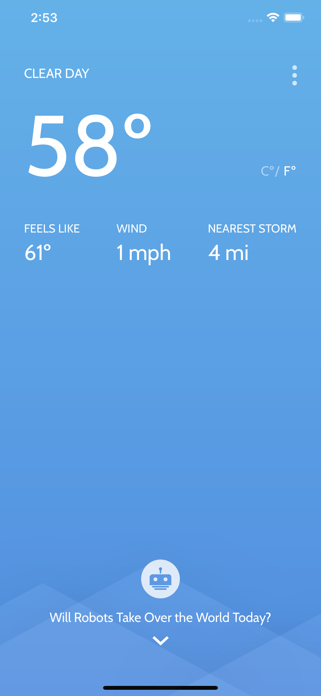
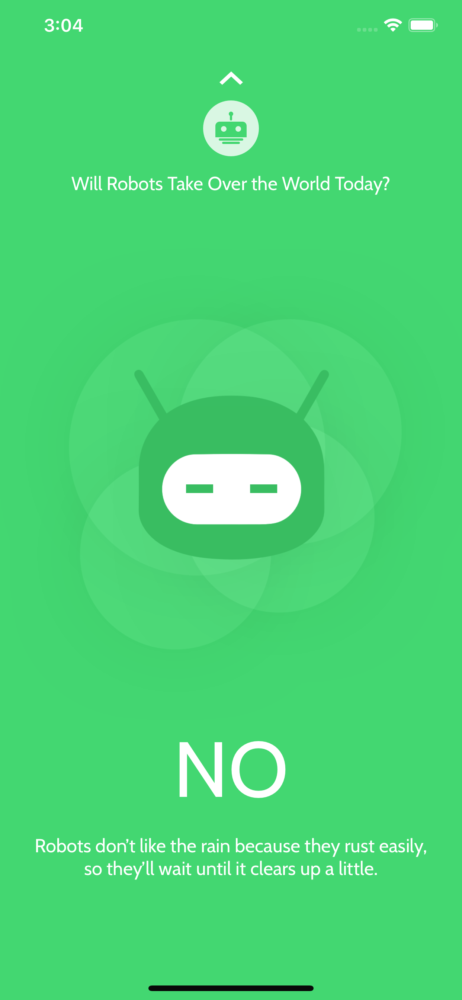
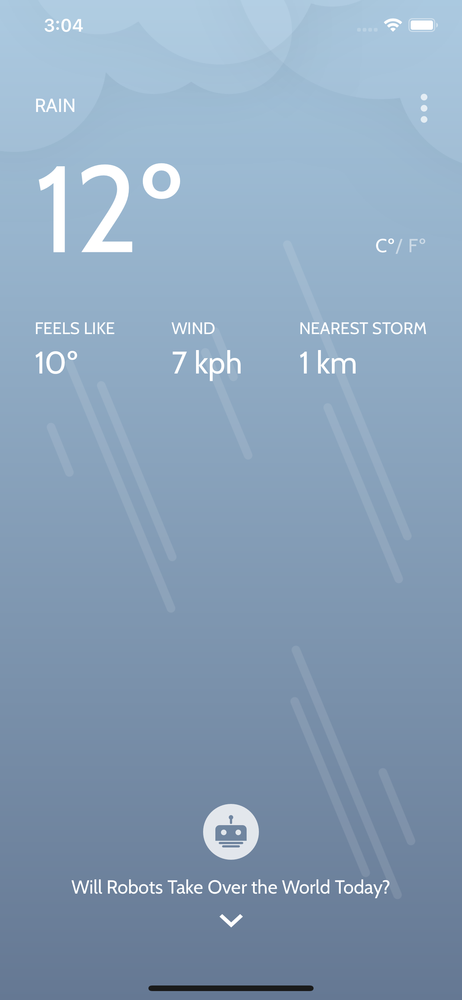
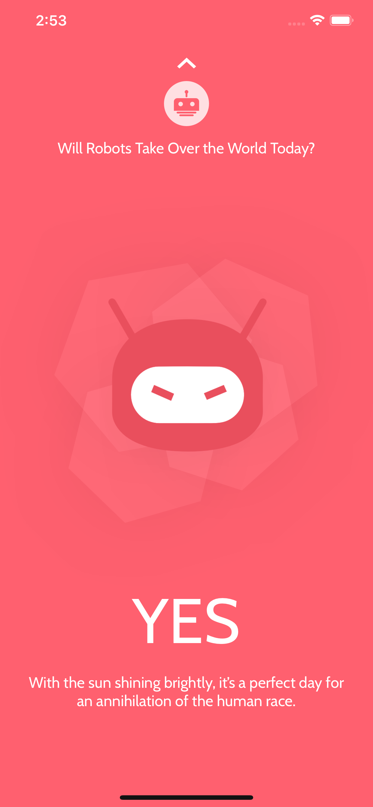

# Will Robots Take Over the World Today?
Tells you "weather" or not robots will take over the world today.
###### *Temporarily no longer in the App Store*

## Screenshots
 |  |  | 
--------------------- | --------------------- | --------------------- | ---------------------

## App Store Description

Artificial Intelligence and robots are infiltrating humanity, and the question on the minds of many humans is, “will robots take over the world?” They beat us at chess, they beat us at Jeopardy, and they beat us at Go. So, at least in the world of games, they have taken the first step. But their intention to take over the world still remains to be seen.

What we do know is that robots don’t like rain. Or snow. Or tornados. So perhaps we can let the weather be our warning system. To know whether we should play outside or run for cover. At least for a day.

So ask yourself the question, “will robots take over today?” Then, open the app and get the answer you’re seeking. Oh, yeah, you can also prepare for hikes, long commutes on bicycles, and trips to the beach with our reliable weather report. Think of it as your all-inclusive weather/robot-takeover report.

Now, get out there and enjoy your world. While it’s still here. Maybe.

## Try for yourself

1. Download or clone the project.
2. Navigate to the directory in Terminal and execute `pod install`.
3. Open the .xcworkspace file in Xcode.
3. Build and run the app in a simulator or your iOS device.
